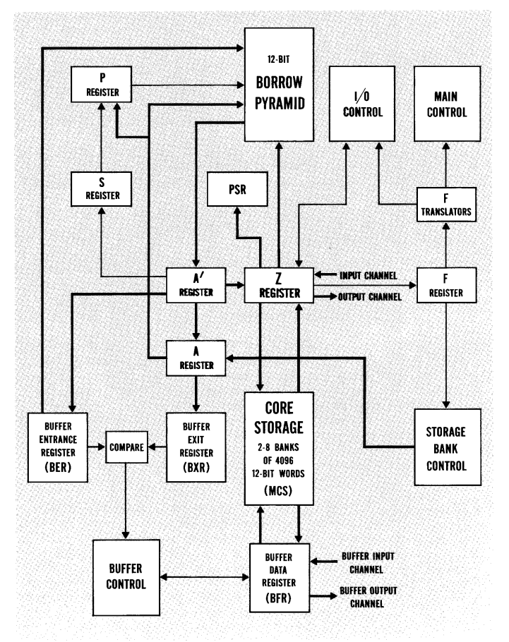

# CDC160A
Toy Emulator of the CDC160A
## Architecture


The real CDC160A had a variety of extra registers that handle I/O, buffered data control, and overflow. Since I wrote this in SML with the power of a computer thousands of times faster than a CDC I chose to ignore those constraints (hence the "Toy" in "Toy Emulator"). We are only concerned with two registers: A and P. A is the arithmetic register (or accumulator) which is where all arithmetic computations take place. P is the program control register which stores the value of the current address in the relative data bank.

The CDC160A had at least two memory banks and could be upgraded to include up to eight in a single machine. Each bank could hold a maximum of 4096 12-bit words[^1]. Banks could then be assigned the role of relative (r), direct (d), indirect (i), or buffer (b) storage:

- (r): Relative storage bank. All instructions are executed from the bank to which the (r) control has been set. (r) also selects the bank which will be referenced by all instructions who operation codes indicate relative or constant addressing.

- (d): Direct storage bank. The storage bank referenced by all instructions having direct addressing operation codes. For operation codes indicating indirect addressing, (d) selects the bank used for the first direct address selection.

- (i): Indirect storage bank. Used for instructions with indirect or memory addressing operation codes, (i) selects which bank will be referenced to select the final operand or address.

- (b): Buffer storage bank. Used for operations which use the buffer I/O channel. Dont worry about this one as I didn't bother implementing it.

This emulator provides three native memory banks. The real CDC160A would let the user select which numbered memory bank would be assigned to which logical function. Currently I haven't implemented the ability to swap banks, so (r), (i), and (d) are fixed to three separate memory banks.

## Instructions
(Note: I have only included a subset of instructions provided by the CDC160A manual)

All codes are in the original octal format. A word is 12-bits. Codes take up one word unless they have a G component, in which case they take up two words.

       - XX refers to a 6-bit constant 

       - XXXX refers to a 12-bit constant

       - YYYY refers to a 12-bit memory address

| OPCODE | F | E | G | Description |
| --- | -- | -- | ---- | ---------- |
| NOP | 00 | 0X | ____ | No operation |
| ERR | 00 | 00 | ____ | Throws an ERROR to Screen |
| HLT | 77 | 00 | ____ | Terminates the session |
| PTA | 01 | 01 | ____ | Transfer P to A |
| LDN | 04 | XX | ____ | Load XX into A |
| LDD | 20 | XX | ____ | Load (d)XX into A |
| LDM | 21 | 00 | YYYY | Load (i)YYYY into A |
| LDI | 21 | XX | ____ | Load (i)((d)XX) into A |
| LDC | 22 | 00 | XXXX | Load XXXX into A |
| LDF | 22 | XX | ____ | Load (r)(P + XX) into A |
| LDB | 23 | XX | ____ | Load (r)(P - XX) into A |
| LCN | 05 | XX | ____ | Load Complement XX into A |
| LCD | 24 | XX | ____ | Load Complement (d)XX into A |
| LCM | 25 | 00 | YYYY | Load Complement (i)YYYY into A |
| LCI | 26 | XX | ____ | Load Complement (i)((d)XX) into A |
| LCC | 26 | 00 | XXXX | Load Complement XXXX into A |
| LCF | 26 | XX | ____ | Load Complement (r)(P + XX) into A |
| LCB | 27 | XX | ____ | Load Complement (r)(P - XX) into A |
| STD | 40 | XX | ____ | Store A into (d)XX |
| STM | 41 | 00 | YYYY | Store A into (i)YYYY |
| STI | 41 | XX | ____ | Store A into (i)((d)XX) |
| STC | 42 | 00 | XXXX | Store A into (r)XXXX  |
| STF | 42 | XX | ____ | Store A into (r)(P + XX) |
| STB | 43 | XX | ____ | Store A into (r)(P - XX) |
| MUL | 01 | 12 | ____ | Multiply A by 10[^2] |
| MUL | 01 | 13 | ____ | Multiply A by 100[^3] |
| ADN | 06 | XX | ____ | Add XX to A |
| ADD | 30 | XX | ____ | Add (d)XX to A |
| ADM | 31 | 00 | YYYY | Add (i)YYYY to A |
| ADI | 31 | XX | ____ | Add (i)((d)XX) to A |
| ADC | 32 | 00 | XXXX | Add XXXX to A |
| ADF | 32 | XX | ____ | Add (r)(P + XX) to A |
| ADB | 33 | XX | ____ | Add (r)(P - XX) to A |
| SBN | 07 | XX | ____ | Subtract XX from A |
| SBD | 34 | XX | ____ | Subtract (d)XX from A |
| SBM | 35 | 00 | YYYY | Subtract (i)YYYY from A |
| SBI | 35 | XX | ____ | Subtract (i)((d)XX) from A |
| SBC | 36 | 00 | XXXX | Subtract XXXX from A |
| SBF | 36 | XX | ____ | Subtract (r)(P + XX) from A |
| SBB | 37 | XX | ____ | Subtract (r)(P - XX) from A |
| LS1 | 04 | XX | ____ | Left shift A by 1 bit[^4] |
| LS2 | 20 | XX | ____ | Left shift A by 2 bits |
| LS3 | 21 | 00 | YYYY | Left shift A by 3 bits |
| LS6 | 21 | XX | ____ | Left shift A by 6 bits |
| RS1 | 22 | 00 | XXXX | Right shift A by 1 bit[^5] |
| RS2 | 22 | XX | ____ | Right shift A by 2 bits |
| LPN | 02 | XX | ____ | Logical AND XX with A |
| LPD | 10 | XX | ____ | Logical AND (d)XX with A |
| LPM | 11 | 00 | YYYY | Logical AND (i)YYYY with A |
| LPI | 11 | XX | ____ | Logical AND (i)((d)XX) with A |
| LPC | 12 | 00 | XXXX | Logical AND XXXX with A |
| LPF | 12 | XX | ____ | Logical AND (r)(P + XX) with A |
| LPB | 13 | XX | ____ | Logical AND (r)(P - XX) with A |
| SCN | 03 | XX | ____ | Logical XOR XX with A[^6] |
| SCD | 14 | XX | ____ | Logical XOR (d)XX with A |
| SCM | 15 | 00 | YYYY | Logical XOR (i)YYYY with A |
| SCI | 15 | XX | ____ | Logical XOR (i)((d)XX) with A |
| SCC | 16 | 00 | XXXX | Logical XOR XXXX with A |
| SCF | 16 | XX | ____ | Logical XOR (r)(P + XX) with A |
| SCB | 17 | XX | ____ | Logical XOR (r)(P - XX) with A |
| ZJF | 60 | XX | ____ | Zero Jump Forward (P + XX) |
| NZF | 61 | XX | ____ | Non-Zero Jump Forward (P + XX) |
| PJF | 62 | XX | ____ | Positive Jump Forward (P + XX) |
| NJF | 63 | XX | ____ | Negative Jump Forward (P + XX) |
| ZJB | 64 | XX | ____ | Zero Jump Backward (P - XX) |
| NZB | 65 | XX | ____ | Non-Zero Jump Backward (P - XX) |
| PJB | 66 | XX | ____ | Positive Jump Backward (P - XX) |
| NJB | 67 | XX | ____ | Negative Jump Backward (P - XX) |
| JPI | 70 | XX | ____ | Jump Indirect[^7] |
| JPR | 71 | 00 | YYYY | Return Jump[^8] |
| JFI | 71 | XX | ____ | Jump Forward Indirect[^9] |
| PRT | 01 | 04 | ____ | Print Contents of A |

[^1]: Why 12-bits? Before the IBM System/360 characters where commonly encoded with 6 bits. The English language has 24 lowercase and 24 uppercase characters totaling 48 unique letters. log~2~(48) = ~5.59 which means that at least 6 bits are needed to encode those letters; why use anymore than one needs? It turned out that the 8-bit encoding of the IBM System/360 was more memory efficient since decimal digits could be "packed" into one byte (only four bits are needed to encode the decimal digits (0-9)), so a 32-bit word could store 8 decimal digits instead of 5.
[^2]: For -314 (oct) to 314 (oct) the result will be correct. For A > +314 or A < -314 then result will be correct modulo 2^12^-1 (204 decimal).
[^3]: For -24 (oct) to 24 (oct) the result will be correct. For A > +24 or A < -24 then result will be correct modulo 2^12^-1 (204 decimal).
[^4]: Left shifts are circular. (400 << 1 => 001)
[^5]: Right shifts are not circular. (001 >> 1 => 000)
[^6]: The CDC160A manual calls this "Selective Complement".
[^7]: ((d)XX) => P
[^8]: (P) + 2 => (r)YYYY; YYYY+1 => P
[^9]: (r)(P + XX) => P

## Running the code

As this is written in SML, you must have an SML interpreter installed on your system. Follow https://www.smlnj.org/ for instructions on how to install SML/NJ. ML-yacc and ML-lex should come alongside your installation of SML/NJ (they are necessary to run the lexer and parser that was written for the emulator).

Once everything is installed you can head to the base folder of the repo, fire up an instance of the SML REPL and type: `CM.make "sources.cm";`

Ideally, everything will compile just fine and you'll see `val it = true : bool` returned by SML.

Then, all you have to do is call the CDC160 structure's emulate method with a text file that contains CDC160A instructions: `CDC160.emulate "test_files/test.cdc";'

### Writing CDC160A Programs

A valid line of CDC160A code as defined by the grammer I wrote to resemble the original assembly code is as follows: [Three capital letters] [Two octal bits] [Two octal bits] [Optional: Four octal bits] [Optional: # Comment String]

An example of a valid line of CDC160A: `LDN 04 10 #Load 8 (decimal) into Reg A`

An example of an invalid line: `LDNN 04 10 #Load 8 (decimal) into Reg A` (Opcode can only be 3-digits long; no more, no less.)

Another example of an invalid line: `LDN 04 103 #Load 67 (decimal) into Reg A` (Only 2-digit and 4-digit octals may be used.)

Here is an example program that performs a few load, add, and print operations:

```
LDN 04 10 #Load 8 into Reg A
ADN 06 12 #Add 10 to Reg A
PRN 01 04 #Print contents of Reg A
LCM 25 00 1234 #Loads complemented contents from (i)1234
PRN 01 04 #Print contents of Reg A
HLT 77 00 #Halt Program
```

It is adviseable to always end with a HLT command; otherwise, the P register will continue to be incremented and could read in data that was not intended to be an instruction and result in unforseen behaviour.